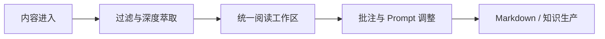

# 炼器房 · Reclaim Feed

> **A local-first workspace for extracting, reading and reusing high-value information.**

多数信息工具擅长「做宽」：接入更多来源、生成更快摘要。炼器房关注另一个问题：**一篇真正重要的内容，怎样从进入系统到被理解、批注和再次使用？**



## 产品判断

- **做深，不做宽**：重点不是信息源数量，而是能否提取水下信息、证据和可复用方法；
- **Prompt 是配置**：评分、萃取和输出规则可以调整，不把个人偏好写死在主流程；
- **消费是闭环的一部分**：Feed、阅读、批注和输出应该在同一条体验里；
- **边界清楚**：系统负责萃取与消费，不重造社交媒体分发工具。

## 当前实现

- FastAPI 后端与 React / Vite 前端；
- 信息流、阅读状态、书签、笔记与信息源管理；
- Prompt 管理、模型服务商和 Bot 配置；
- URL 快速提取入口；
- Docker 部署与本地测试环境；
- PWA 与移动端基础适配。

## 系统结构

```text
frontend/   阅读、批注、Prompt 与设置界面
backend/    API、数据模型、任务与信息处理
config/     来源、规则和运行配置
docs/       部署与产品文档
```

部署说明见 [`docs/deploy_docker.md`](./docs/deploy_docker.md)。

## 和 100X 的关系

- **[100X Research Engine](https://github.com/bor799/100x-research-engine)** 负责稳定获取、评估、排队与交付；
- **Reclaim Feed** 负责探索人如何消费、修正和再使用结果。

前者优先保证可靠性，后者优先验证产品体验。它们是上下游，而不是两个重复项目。

## 边界与下一步

当前仓库是单机全栈产品实验，不把「可部署」写成「已经规模化」。下一步重点不是继续增加信息源，而是验证：用户是否会持续阅读、批注并把萃取结果带回自己的工作。

## My role

我负责产品定位、信息生命周期、功能边界和交互判断；AI 负责把这些约束快速实现为可运行的前后端系统。
