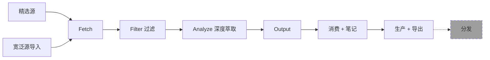

# 100X 知识 Agent — 产品架构（最终版）

## 核心原则

> **做深不做宽。** 主流程不变，配置全部外置，不造轮子。
>
> "做宽"（信息聚合）大家都有了，没有护城河。产品价值在**萃取深度**——从一篇文章里挖出水下信息、核心金句、可复用方法论。

---

## 两层信息源模型

| 层 | 说明 | 例子 |
|----|------|------|
| **精选源（核心）** | 高质量、深度内容，如 Karpathy 推荐的 RSS | 当前已有的 17 个 RSS + Twitter 关注 |
| **宽泛源（导入）** | 外部聚合器的输出，作为候选池导入 | Horizon 日报 / HN Top / 关键词订阅 |

宽泛源导入后，经过**关键词过滤 → LLM 评分**，高分内容才进入深度萃取。这样既不丢失广度，又聚焦深度。

---

## 信息生命周期



| 阶段 | 职责 | 边界 |
|------|------|------|
| 萃取 | Fetch→Filter→Analyze | ✅ 做 |
| 消费 | 阅读 + 笔记批注 | ✅ 做 |
| 生产 | 导出（MD/JSON/NotebookLM） | ✅ 做 |
| 分发 | 小红书/推文发布 | ⬜ 留接口 |

---

## 4 个消费渠道

| 渠道 | 说明 | 阶段 |
|------|------|------|
| **Obsidian** | 本地 Markdown + Dataview 看板 | Phase 1 |
| **IM（飞书/Telegram）** | claude-to-im 推送 | Phase 2 |
| **GUI 前端** | Web 阅读 + 笔记 + 配置 | Phase 3 |
| **邮件订阅** | 日报 / 高分内容推送到邮箱 | Phase 2 |

---

## 4 种交付形态

| 形态 | 面向 | 说明 |
|------|-----|------|
| **本地安装** | 开发者 | `uv sync` / `pip install`，命令行跑 |
| **Docker** | 服务器/团队 | `docker-compose up`，云端 24h 运行 |
| **Skill** | Agent 用户 | SKILL.md，Agent 读后自动调用 |
| **MCP Server** | Agent 深度集成 | 暴露 pipeline 各阶段为 MCP Tool |

---

## 生态工具

### ✅ Phase 1 集成

| 工具 | 用途 |
|------|------|
| [Agent-Reach](https://github.com/Panniantong/Agent-Reach) | Twitter/小红书/Reddit 抓取 |
| [yt-search-download](https://github.com/joeseesun/yt-search-download) | YouTube 搜索+字幕 |
| [bilibili-watcher](https://github.com/openakita/openakita/tree/main/skills/bilibili-watcher) | B站字幕提取 |

### 🔌 后续接入

| 工具 | 用途 |
|------|------|
| [claude-to-im](https://github.com/op7418/Claude-to-IM) | 飞书/Telegram 推送 |
| [anything-to-notebooklm](https://github.com/joeseesun/anything-to-notebooklm) | 导出到 NotebookLM |
| [baoyu-skills](https://github.com/jimliu/baoyu-skills) | 小红书图文/封面/Slide |
| 关注列表导入 | 各平台关注/点赞/收藏批量导入 |

---

## 4 层可配置 Prompt

| 层 | 文件 | 说明 |
|----|------|------|
| ① 信息源 | `sources.yaml` | RSS/Twitter/B站/YouTube/公众号 |
| ② 过滤 | `prompts/scoring.md` | LLM 评分（非硬编码关键词） |
| ③ 萃取 | `prompts/extraction.md` | 深度萃取格式 |
| ④ 输出 | `prompts/obsidian_format.md` | Markdown / IM 卡片模板 |

> [!NOTE]
> 100X 的 LLM 评分优于 Horizon 的硬编码关键词匹配——用户通过改 Prompt 就能适配任何领域，而 Horizon 需要改 Python 代码。

---

## 目录结构

```
100x-knowledge-agent/
├── backend/
│   ├── src/
│   │   ├── pipeline.py           # 不可变核心
│   │   ├── api/main.py           # FastAPI REST
│   │   ├── mcp/server.py         # MCP Server
│   │   ├── fetchers/
│   │   ├── processors/
│   │   └── outputs/              # Store/Obsidian/Email
│   ├── config/
│   │   ├── config.example.yaml
│   │   ├── prompts/
│   │   └── rss_sources.json
│   ├── Dockerfile
│   ├── docker-compose.yml
│   ├── pyproject.toml            # uv 包管理
│   └── SKILL.md                  # Agent Skill 说明
├── im-bridge/
├── frontend/
└── README.md
```

---

## Phase 1 执行清单

- [ ] 新建 `100x-knowledge-agent/backend/`
- [ ] `pyproject.toml` + `uv`（替代 requirements.txt）
- [ ] 迁移 fetchers / processors / outputs
- [ ] `pipeline.py`（不可变核心，async）
- [ ] Prompt 外置到 `config/prompts/`
- [ ] FastAPI 接口
- [ ] `config.example.yaml`
- [ ] `Dockerfile` + `docker-compose.yml`
- [ ] 清理 `.backup` 文件
- [ ] 导出/导入 API 预留
